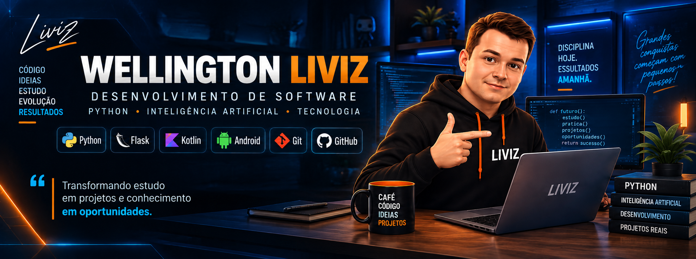

  

---

## 🚀 Sobre mim

- 💻 Experiência como **Analista de Operações na Edge UOL**
- 🏦 Atuação em ambiente dedicado ao segmento bancário
- 📊 Experiência com **Zabbix**, sistemas, incidentes e máquinas virtuais
- 🎓 **3 semestres de Análise e Desenvolvimento de Sistemas**
- 🤖 Atualmente cursando **Tecnologia em Inteligência Artificial**
- 🧠 Desenvolvendo projetos próprios para aplicar programação em problemas reais
- 🎯 Interesse profissional em **Desenvolvimento de Software**

---

## 🛠️ Tecnologias

  
  
  
  
  
  
  
  
  

---

## 🔧 Projeto em destaque

### Dr Reparos IA

Aplicativo de assistência residencial inteligente desenvolvido para orientar pessoas diante de problemas de manutenção residencial.

O projeto nasceu da união entre minha experiência prática com manutenção e meu desenvolvimento na área de tecnologia.

### Funcionalidades atuais

- Diagnóstico guiado de problemas residenciais
- Orientações de segurança
- Lista de ferramentas e materiais
- Passo a passo para execução de reparos
- Integração com links de materiais
- Opção de videochamada com técnico
- Solicitação de atendimento presencial
- Aplicativo Android funcional

### Tecnologias utilizadas

**Python • Flask • HTML/CSS • Kotlin • Android Studio • WebView • Android Intents • Git • GitHub • Render**

🔗 **Projeto:**
https://github.com/wellingtonliviz-a11y/DrReparosIA-Android

---

## 📊 Outros projetos

### Liviz Quant

Desenvolvimento de indicadores quantitativos para plataformas de mercado financeiro, utilizando lógica de programação, cálculos matemáticos, percentuais, variáveis e parametrização para projeção automática de regiões de preço.

---

## 📚 Atualmente estudando

- Inteligência Artificial
- Python
- Desenvolvimento Backend
- Desenvolvimento Android
- Estruturação e evolução de aplicações
- Integração de IA em sistemas

---

## 📫 Contato

📧 **Email:** wellingtonliviz@gmail.com

💼 **LinkedIn:** [Wellington Liviz](https://www.linkedin.com/in/wellington-liviz-567001249/)

📍 Pindamonhangaba - SP
